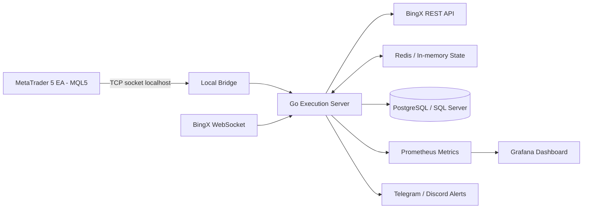

# Specifica Tecnica — Bot BTC Scalping MT5 → BingX

**Versione:** v1.0  
**Lingua:** Italiano  
**Destinatario:** Claude Opus / Developer / Coding Agent  
**Obiettivo:** sviluppare da zero un bot di trading BTC scalping che usa **MetaTrader 5 esclusivamente come generatore di segnali** e invia/esegue ordini su **BingX Futures/Perpetual tramite API**.

---

## 0. Regola fondamentale

Il progetto deve lavorare **solo con MetaTrader 5 / MQL5**.

Non considerare MetaTrader 4.  
Non proporre soluzioni MT4.  
Non usare WebRequest come metodo principale di comunicazione.  
Non eseguire trade reali su MT5.

MetaTrader 5 deve essere usato solo come:

```text
Signal Generator
```

L'esecuzione reale deve avvenire solo su BingX.

Flusso target:

```text
MetaTrader 5 EA
→ genera segnale trading
→ socket bridge locale low-latency
→ execution server in Go
→ BingX API
→ ordine eseguito su BingX
→ logging + monitoring + risk engine
```

---

## 1. Executive Summary

Il progetto consiste nello sviluppo di un'infrastruttura completa per uno scalper Bitcoin ultra-veloce. La strategia nasce dentro MetaTrader 5, ma MT5 non deve più eseguire ordini. L'EA MT5 deve generare segnali e inviarli a un bridge locale. Il bridge passa il segnale a un execution server scritto preferibilmente in Go. Il server calcola size, rischio, quantity finale, controlla il prezzo reale BingX, invia ordini limit su BingX, gestisce trailing, stop, take profit, cancel/replace, log, metriche e kill switch.

La strategia opera solo su BTC/USDT futures/perpetual, con trade da circa 1 a 6 secondi, take profit massimo di circa 60 USDT di movimento su BTC, rischio base 1% del capitale, rischio 2% dopo due stop loss consecutivi, massimo tre trade al giorno e stop trading dopo tre stop loss giornalieri.

Il problema principale non è soltanto scrivere il bot. Il problema principale è costruire un sistema che sia:

```text
veloce
anti-slippage
misurabile
controllato
sicuro
idempotente
compatibile con trade da 1-6 secondi
```

Con un TP massimo di 60 USDT su BTC, anche pochi dollari di slippage, fee o ritardo possono compromettere la strategia. Per questo il sistema deve usare solo limit order, preferibilmente aggressive limit order o post-only + escalation controllata, e deve cancellare o riprezzare rapidamente gli ordini non fillati.

---

## 2. Contesto strategico

La strategia si sposta da broker CFD a BingX perché l'obiettivo è ridurre lo slippage al minimo.

Il broker CFD precedente introduceva slippage troppo elevato per una strategia con target così stretto. BingX viene scelto perché l'esecuzione su exchange con order book, limit order e controllo del prezzo massimo/minimo accettato dovrebbe permettere un'esecuzione più pulita e più misurabile.

Obiettivo tecnico:

```text
slippage nullo o quasi nullo
```

Non si può promettere zero slippage assoluto, ma il sistema deve essere progettato per:

```text
- evitare esecuzioni oltre soglia
- non entrare se il prezzo è scappato
- cancellare ordini stale
- misurare ogni fill
- dimostrare il vantaggio reale rispetto al broker CFD
```

---

## 3. Requisiti funzionali principali

### 3.1 Mercato

```text
Asset: BTC
Mercato: BTC/USDT perpetual/futures su BingX
Direzione: Long e Short
Piattaforma segnale: MetaTrader 5
Esecuzione reale: BingX API
```

### 3.2 Strategia

```text
Tipo: scalping ultra-veloce
Durata trade: 1-6 secondi
Take profit massimo: circa 60 USDT di movimento BTC
Stop loss: obbligatorio, tecnico e coerente con rischio 1-2%
Trailing: dinamico, gestito lato server
Massimo trade giornalieri: 3
Massimo stop loss giornalieri: 3
Rischio base: 1% capitale
Rischio aumentato: 2% dopo due stop loss consecutivi
Max posizioni aperte: 1
```

### 3.3 Ordini

```text
Solo LIMIT ORDER
No market order
Preferenza: aggressive limit order / post-only probe + bounded IOC
Cancel/replace rapido se non fillato
Timeout ordine molto breve
```

### 3.4 MetaTrader 5

MT5 deve:

```text
- ricevere tick
- calcolare indicatori leggeri
- generare segnali
- inviare segnali via socket
- ricevere ack dal bridge
- non eseguire trade reali
- non chiamare direttamente BingX
- non fare database heavy operations
```

### 3.5 Execution Server

Il server deve:

```text
- ricevere segnali da MT5
- validare segnale
- controllare duplicati
- controllare risk state
- calcolare quantity finale BingX
- controllare prezzo e order book BingX
- inviare ordine limit
- gestire ack/fill/cancel/replace
- gestire trailing stop/take profit
- gestire stop loss
- gestire max duration trade
- gestire kill switch
- salvare log e metriche
```

---

## 4. Architettura consigliata

### 4.1 Architettura high-level

```text
MT5 EA in MQL5
    ↓ socket TCP locale
Local Bridge / Signal Gateway
    ↓ internal protocol
Execution Server in Go
    ↓ REST signed API / WebSocket
BingX
    ↓
Redis / In-memory State
    ↓
PostgreSQL or SQL Server Async Logs
    ↓
Prometheus / Grafana / Alerts
```

### 4.2 Diagramma



### 4.3 Prima release consigliata

Per la prima release non usare Kubernetes e non usare architetture troppo distribuite.

Prima release consigliata:

```text
1 VPS Windows o ambiente compatibile con MT5
MT5 terminal
EA MQL5
Bridge locale
Execution server Go
Redis locale o embedded/in-memory state
PostgreSQL o SQL Server per log asincroni
Prometheus/Grafana opzionali ma consigliati
```

Motivo:

```text
meno hop
meno jitter
meno complessità
migliore controllo latenza
debug più semplice
```

---

## 5. Stack tecnico consigliato

| Componente | Scelta consigliata | Motivazione |
|---|---|---|
| Signal Generator | MQL5 EA | Compatibilità con MT5 |
| Bridge | TCP socket locale | Bassa latenza, meno overhead |
| Execution Server | Go | Performance, concorrenza, semplicità |
| Stato caldo | Redis o in-memory Go | Velocità, deduplica, risk state |
| Database | PostgreSQL o SQL Server | Log, audit, storico, replay |
| Monitoring | Prometheus + Grafana | Metriche, p95/p99, alert |
| Alert | Telegram / Discord | Operatività immediata |
| Secrets | Env vars / Vault / Secrets Manager | API key sicure |
| Deployment | VPS low-latency | Semplicità e controllo |

### 5.1 Perché Go

Go è consigliato perché:

```text
- gestisce bene WebSocket e REST API
- ha goroutine leggere
- è più semplice di C++
- è più performante e stabile di Python per execution live
- è facile da mantenere
- è adatto a sistemi I/O-bound low-latency
```

### 5.2 C++ come alternativa

C++ può essere usato se il team è molto esperto, ma aumenta complessità e rischio di bug. Per questo progetto il miglior compromesso è Go.

### 5.3 Python

Python può essere usato per:

```text
- analysis offline
- backtest
- report
- notebook
- data processing non critico
```

Non dovrebbe essere usato per l'execution server principale.

---

## 6. MetaTrader 5 EA — Specifica

### 6.1 Obiettivo EA

L'EA MT5 deve essere leggero e non bloccante.

Responsabilità:

```text
- OnInit: inizializzazione parametri, socket, buffer
- OnTick: leggere tick, aggiornare buffer, calcolare feature, generare segnale
- OnTimer: health check bridge, reconnect, housekeeping
- Socket client: invio segnale, ricezione ack
- Logger minimale locale
```

### 6.2 Cose da evitare

Non fare:

```text
- WebRequest verso BingX
- chiamate HTTP sincrone
- query database
- log pesanti in OnTick
- calcoli troppo complessi in OnTick
- loop bloccanti
- trading diretto MT5
```

### 6.3 OnTick

L'EA deve:

```text
1. leggere ultimo tick
2. aggiornare ring buffer
3. calcolare feature rolling
4. verificare condizione segnale
5. se segnale valido, inviare payload al bridge
6. non aspettare troppo l'ack
```

Pseudo-logica:

```mql5
void OnTick()
{
    MqlTick tick;
    if(!SymbolInfoTick(_Symbol, tick))
        return;

    UpdateTickBuffer(tick);

    Features f = CalculateFeatures();

    Signal s;
    if(GenerateSignal(f, s))
    {
        SendSignalToBridge(s);
    }
}
```

### 6.4 Buffer tick

Mantenere buffer rolling per:

```text
250 ms
500 ms
1000 ms
2000 ms
```

Feature principali:

```text
mid price
bid
ask
spread
velocity 250ms
velocity 500ms
velocity 1000ms
acceleration
micro EMA fast
micro EMA slow
micro ATR 1s
micro ATR 2s
```

### 6.5 Socket MT5

Usare socket TCP persistente verso:

```text
127.0.0.1:PORT
```

Payload consigliato: JSON newline-delimited oppure binary length-prefixed.

Per MVP: JSON newline-delimited.

Formato:

```text
{json}\n
```

### 6.6 Ack dal bridge

Il bridge deve rispondere subito con:

```json
{
  "type": "ACK",
  "signal_id": "uuid",
  "received_ms": 1760000000000,
  "status": "accepted"
}
```

Se il bridge non risponde entro timeout breve:

```text
- log error
- non ritentare in loop bloccante dentro OnTick
- gestire reconnect via OnTimer
```

---

## 7. Strategia proposta

### 7.1 Tipo strategia

Strategia consigliata:

```text
BTC Micro Momentum Scalper con Order Book Confirmation
```

Due layer:

```text
1. MT5 Layer
   - genera segnale grezzo da tick/price action/micro indicatori

2. Server Layer
   - conferma il segnale usando prezzo reale BingX, bid/ask, book, spread, latency
```

### 7.2 Indicatori consigliati

Non usare indicatori lenti tipo RSI 14 su M1 o MACD standard come base principale.

Usare:

```text
- price velocity
- price acceleration
- micro momentum
- micro EMA
- tick-based logic
- spread filter
- micro ATR
- order book filter lato server
- bid/ask imbalance
- microprice
```

### 7.3 Feature MT5

```text
mid = (bid + ask) / 2
spread = ask - bid

velocity_250ms = mid_now - mid_250ms_ago
velocity_500ms = mid_now - mid_500ms_ago
velocity_1000ms = mid_now - mid_1000ms_ago

acceleration = velocity_250ms - velocity_1000ms

ema_fast = EMA su micro-window breve
ema_slow = EMA su micro-window più lunga

micro_atr_1s = media variazioni assolute su 1s
micro_atr_2s = media variazioni assolute su 2s
```

### 7.4 Feature server-side BingX

Il server deve calcolare:

```text
best_bid
best_ask
spread_bingx
mid_bingx
book imbalance L1
book imbalance top 5
microprice
feed freshness
price dislocation MT5 vs BingX
```

Esempio imbalance:

```text
imbalance_L1 = bid_size / (bid_size + ask_size)
```

Long favorito se:

```text
imbalance_L1 > 0.55 / 0.60
```

Short favorito se:

```text
imbalance_L1 < 0.45 / 0.40
```

Le soglie vanno testate.

---

## 8. Logica ingresso long

Condizioni suggerite:

```text
1. Nessuna posizione aperta
2. Daily trades < 3
3. Daily stop losses < 3
4. Risk engine abilitato
5. Feed MT5 fresco
6. Bridge sano
7. BingX market data fresco
8. Spread MT5 sotto soglia
9. Spread BingX sotto soglia
10. velocity_250ms positiva
11. velocity_500ms positiva
12. velocity_1000ms positiva o neutra
13. acceleration positiva o non negativa
14. EMA fast > EMA slow
15. micro ATR sufficiente ma non eccessivo
16. BingX book imbalance favorevole
17. prezzo BingX non già scappato oltre soglia
```

Pseudocodice:

```text
IF no_open_position
AND daily_trades < 3
AND daily_stop_losses < 3
AND latency_status == healthy
AND spread_mt5 <= max_spread_mt5
AND spread_bingx <= max_spread_bingx
AND velocity_250ms >= min_vel_250_long
AND velocity_500ms >= min_vel_500_long
AND ema_fast > ema_slow
AND micro_atr_1s BETWEEN min_atr AND max_atr
AND bingx_imbalance >= min_long_imbalance
THEN create OPEN_LONG signal
```

---

## 9. Logica ingresso short

Condizioni speculari:

```text
1. Nessuna posizione aperta
2. Daily trades < 3
3. Daily stop losses < 3
4. Risk engine abilitato
5. Feed MT5 fresco
6. Bridge sano
7. BingX market data fresco
8. Spread MT5 sotto soglia
9. Spread BingX sotto soglia
10. velocity_250ms negativa
11. velocity_500ms negativa
12. velocity_1000ms negativa o neutra
13. acceleration negativa o non positiva
14. EMA fast < EMA slow
15. micro ATR sufficiente ma non eccessivo
16. BingX book imbalance favorevole allo short
17. prezzo BingX non già scappato oltre soglia
```

Pseudocodice:

```text
IF no_open_position
AND daily_trades < 3
AND daily_stop_losses < 3
AND latency_status == healthy
AND spread_mt5 <= max_spread_mt5
AND spread_bingx <= max_spread_bingx
AND velocity_250ms <= -min_vel_250_short
AND velocity_500ms <= -min_vel_500_short
AND ema_fast < ema_slow
AND micro_atr_1s BETWEEN min_atr AND max_atr
AND bingx_imbalance <= max_short_imbalance
THEN create OPEN_SHORT signal
```

---

## 10. Parametri iniziali consigliati

Questi sono parametri iniziali di lavoro, non definitivi.

```yaml
symbol: BTC-USDT
market_type: perpetual

risk:
  base_risk_percent: 1.0
  escalated_risk_percent: 2.0
  escalate_after_consecutive_stop_losses: 2
  max_daily_trades: 3
  max_daily_stop_losses: 3
  max_open_positions: 1

trade:
  max_trade_duration_ms: 6000
  initial_stop_loss_usd: 30
  max_take_profit_usd: 60
  time_stop_no_progress_ms: 1500
  min_favorable_move_before_hold_usd: 8

trailing:
  enabled: true
  activation_usd: 20
  step_1_profit_usd: 20
  step_1_lock_usd: 2
  step_2_profit_usd: 35
  step_2_lock_usd: 15
  step_3_profit_usd: 50
  step_3_lock_usd: 35

latency:
  max_signal_age_ms: 250
  max_mt5_to_bridge_ms: 10
  max_signal_to_ack_ms: 150
  max_signal_to_fill_ms: 250

orders:
  order_type: LIMIT_ONLY
  entry_mode: POST_ONLY_PROBE_THEN_AGGRESSIVE_IOC
  maker_probe_timeout_ms: 80
  aggressive_ioc_timeout_ms: 150
  max_total_entry_window_ms: 250
  max_reprice_attempts: 2
  max_entry_slippage_usd: 3
  max_exit_slippage_usd: 5
```

---

## 11. Stop Loss

Lo stop loss deve essere coerente con rischio monetario e distanza in USD.

Formula:

```text
risk_amount_usdt = equity_usdt * risk_percent
qty_btc = risk_amount_usdt / stop_distance_usd
```

Esempio:

```text
Equity = 1000 USDT
Risk = 1% = 10 USDT
Stop distance = 30 USDT

qty = 10 / 30 = 0.3333 BTC
```

Con rischio 2%:

```text
Equity = 1000 USDT
Risk = 2% = 20 USDT
Stop distance = 30 USDT

qty = 20 / 30 = 0.6666 BTC
```

Nota critica:

```text
Questa quantity potrebbe richiedere leva significativa.
Il server deve verificare margine, leverage massimo, min quantity, step size e liquidazione.
```

Il sistema deve rifiutare il trade se:

```text
- leva richiesta troppo alta
- margine insufficiente
- liquidation risk troppo vicino
- quantity sotto min quantity
- quantity non normalizzabile
```

---

## 12. Take Profit

TP massimo:

```text
60 USDT di movimento BTC
```

Non significa che il bot debba aspettare sempre 60.

Il server può uscire prima se:

```text
- momentum si spegne
- order book gira contro
- velocity cambia segno
- trade non progredisce entro 1-1.5s
- trailing stop viene colpito
```

Regole:

```text
IF profit_move >= 60
THEN close_position("MAX_TP_REACHED")

IF time_in_trade >= 6000ms
THEN close_position("MAX_DURATION")

IF time_in_trade >= 1500ms AND favorable_move < min_progress
THEN close_position("NO_PROGRESS")
```

---

## 13. Trailing Stop / Trailing Take Profit

Il trailing non deve essere troppo nervoso. Con trade da 1-6 secondi e limit order only, un trailing continuo genera troppi cancel/replace.

Usare trailing step-based.

Esempio long:

```text
Entry = 100000

Se prezzo arriva a 100020:
    trailing attivo
    stop protetto vicino a breakeven

Se prezzo arriva a 100035:
    lock profit parziale

Se prezzo arriva a 100050:
    lock profit più stretto

Se prezzo arriva a 100060:
    close per max TP
```

Esempio parametri:

```text
+20 USD → lock +2 USD
+35 USD → lock +15 USD
+50 USD → lock +35 USD
+60 USD → close
```

Per short è speculare.

---

## 14. Execution Model — Limit Only

### 14.1 Problema

Il bot deve usare solo limit order. Questo riduce slippage, ma aumenta il rischio di mancato fill.

Quindi il sistema non deve "inseguire" il mercato. Deve entrare solo se il prezzo è ancora valido.

### 14.2 Modello consigliato

Entry model:

```text
1. Server riceve segnale
2. Controlla prezzo reale BingX
3. Controlla spread e book
4. Se condizioni valide:
   a. prova post-only/maker per finestra brevissima
   b. se non fillato, usa aggressive limit IOC/FOK bounded
5. Se non fillato entro max_total_entry_window:
   cancella / abortisce
```

### 14.3 Maker probe

```text
Durata: 80-120 ms
Tipo: LIMIT PostOnly
Obiettivo: provare ad avere maker fee e zero slippage
```

Se fill:

```text
trade attivo
```

Se non fill:

```text
passa a aggressive bounded limit se segnale ancora valido
```

### 14.4 Aggressive limit

Long:

```text
best_ask = 100000
max_entry_slippage = 3
buy_limit = 100003
```

Short:

```text
best_bid = 100000
max_entry_slippage = 3
sell_limit = 99997
```

Se non fill entro timeout:

```text
cancel
no trade
```

### 14.5 Uscita

Per uscire:

```text
- take profit: può essere resting limit reduce-only
- trailing/stop: aggressive limit reduce-only
- emergency: aggressive limit reduce-only con cap più largo
```

Se l'uscita non viene fillata:

```text
1. cancel/replace
2. aumentare aggressività entro soglia
3. se ancora non fillato, trigger emergency mode
4. alert umano
5. freeze nuove entry
```

---

## 15. Anti-slippage Strategy

Obiettivo:

```text
slippage medio vicino a 0
slippage massimo sempre sotto soglia
```

Il sistema deve misurare due tipi di slippage:

### 15.1 Slippage vs MT5

```text
entry_slippage_mt5 = fill_price - mt5_signal_price
```

Misura differenza tra prezzo visto da MT5 e prezzo reale eseguito.

### 15.2 Slippage vs BingX Quote

Long:

```text
entry_slippage_bingx = fill_price - bingx_best_ask_before_send
```

Short:

```text
entry_slippage_bingx = bingx_best_bid_before_send - fill_price
```

Questo misura la qualità reale dell'execution.

### 15.3 Regole anti-slippage

```text
- non inviare ordine se feed BingX stale
- non inviare ordine se spread troppo largo
- non inviare ordine se price dislocation MT5/BingX troppo alta
- non inviare ordine se signal age > 250ms
- usare limit cap
- cancellare se non fillato entro timeout
- misurare ogni fill
- kill switch se slippage p95 supera soglia
```

### 15.4 Acceptance slippage

Target iniziali:

```text
average entry slippage <= 1 USDT
average exit slippage <= 1 USDT
max entry slippage <= 3 USDT
max exit slippage <= 5 USDT
```

Questi target vanno validati live.

---

## 16. Latenza — Tempi realistici dal segnale al mercato

### 16.1 Definizioni

**Signal-to-ACK**

```text
Tempo da segnale generato in MT5 a ordine accettato da BingX.
```

**Signal-to-Fill**

```text
Tempo da segnale generato in MT5 a ordine realmente eseguito.
```

Per la strategia conta soprattutto signal-to-fill.

### 16.2 Breakdown realistico

| Segmento | Best case | Realistico | Problema se supera |
|---|---:|---:|---:|
| MT5 genera segnale | 0.5-2 ms | 1-5 ms | >10 ms |
| MT5 → bridge socket | <1 ms | 1-3 ms | >10 ms |
| Bridge / Go server | 1-3 ms | 3-10 ms | >20 ms |
| Firma + prepare request | 1-5 ms | 5-15 ms | >30 ms |
| Rete + BingX ACK | 30-60 ms | 60-150 ms | >250 ms |
| Fill aggressive limit | 0-50 ms | 50-200 ms | >300 ms |

### 16.3 Target

```text
Signal-to-ACK realistic target: 70-180 ms
Signal-to-Fill realistic target: 100-250 ms
Best optimized signal-to-ACK: 40-80 ms
Best optimized signal-to-Fill: 50-150 ms
```

### 16.4 Soglie operative

```text
p95 signal-to-ack < 150 ms
p99 signal-to-ack < 300 ms

p95 signal-to-fill < 250 ms
p99 signal-to-fill < 400 ms

max entry order window < 250 ms
```

Se spesso:

```text
signal-to-fill > 300 ms
```

il segnale è probabilmente vecchio.

Se spesso:

```text
signal-to-fill > 500 ms
```

la strategia è troppo lenta per TP da 60 USDT.

---

## 17. Conversione lotti MT5 → quantity BingX

### 17.1 Problema

MT5 usa lotti.

BingX usa quantity / volume.

Il mapping non può essere indovinato. Deve essere letto dal simbolo MT5 e normalizzato sul contratto BingX.

### 17.2 Dati MT5 necessari

L'EA deve leggere:

```text
SYMBOL_TRADE_CONTRACT_SIZE
SYMBOL_VOLUME_MIN
SYMBOL_VOLUME_STEP
SYMBOL_VOLUME_MAX
SYMBOL_TRADE_TICK_SIZE
SYMBOL_TRADE_TICK_VALUE
```

### 17.3 Dati BingX necessari

Il server deve recuperare:

```text
symbol
pricePrecision
quantityPrecision
minQty
maxQty
qtyStep
tickSize
leverage limits
margin requirements
fee tier
```

### 17.4 Regola consigliata

La quantity finale deve essere calcolata dal server, non da MT5.

MT5 invia:

```text
legacy_lots
contract_size
signal price
risk context
```

Server calcola:

```text
risk_amount
stop_distance
raw_qty
normalized_qty
margin_required
leverage_required
```

### 17.5 Formula

```text
risk_amount = equity * risk_percent
raw_qty_btc = risk_amount / stop_distance_usd
normalized_qty = floor(raw_qty_btc / qty_step) * qty_step
```

Poi validare:

```text
normalized_qty >= min_qty
margin_available >= required_margin
leverage <= max_leverage
```

---

## 18. Risk Engine

### 18.1 Regole base

```text
base_risk = 1%
risk_after_two_consecutive_losses = 2%
max_daily_trades = 3
max_daily_stop_losses = 3
max_open_positions = 1
```

### 18.2 Escalation

```text
IF consecutive_stop_losses < 2:
    risk_percent = 1%

IF consecutive_stop_losses >= 2:
    risk_percent = 2%
```

Esempio:

```text
Trade 1: rischio 1% → stop
Trade 2: rischio 1% → stop
Trade 3: rischio 2% → ultimo tentativo
```

Se trade 3 va in stop:

```text
stop trading for the day
```

### 18.3 Daily stop

```text
IF daily_stop_losses >= 3:
    trading_enabled = false
```

### 18.4 No revenge trading

Il sistema non può superare le regole.

Anche se arrivano segnali validi:

```text
daily_trades >= 3 → reject signal
daily_stop_losses >= 3 → reject signal
open_position_exists → reject signal
risk_engine_halted → reject signal
```

### 18.5 Kill switch

Trigger kill switch se:

```text
- API BingX non risponde
- WebSocket stale
- signal-to-ack p95 sopra soglia
- signal-to-fill p95 sopra soglia
- slippage p95 sopra soglia
- ordine duplicato rilevato
- posizione locale diversa da BingX
- database/log writer rotto per troppo tempo
- Redis/state store non disponibile
- errore margin/leverage ripetuto
```

---

## 19. State Machine

### 19.1 Signal State

```text
CREATED
SENT_TO_BRIDGE
ACKED_BY_BRIDGE
RECEIVED_BY_SERVER
ACCEPTED_BY_RISK
REJECTED_BY_RISK
SUBMITTED_TO_BINGX
ORDER_ACKED
ORDER_FILLED
ORDER_EXPIRED
ORDER_CANCELLED
POSITION_OPEN
POSITION_CLOSING
POSITION_CLOSED
ERROR
```

### 19.2 Order State

```text
NEW
SUBMITTING
ACKED
PARTIALLY_FILLED
FILLED
CANCEL_REQUESTED
CANCELLED
REPLACE_REQUESTED
REPLACED
REJECTED
EXPIRED
UNKNOWN
```

### 19.3 Position State

```text
NONE
OPENING
OPEN
CLOSING
CLOSED
DESYNC
EMERGENCY
```

---

## 20. Idempotenza e ordini duplicati

Ogni segnale deve avere un `signal_id` univoco.

Ogni ordine deve avere un `client_order_id` deterministico.

Formato consigliato:

```text
btcscalp-{account_id}-{YYYYMMDD}-{signal_seq}-{role}-{attempt}
```

Esempio:

```text
btcscalp-main-20260521-000123-entry-01
btcscalp-main-20260521-000123-exit-01
```

Regole:

```text
- mai inviare due entry per lo stesso signal_id
- prima di retry, controllare stato per client_order_id
- se timeout API, riconciliare prima di reinviare
- se stato unknown, freeze nuove entry
```

---

## 21. BingX API Integration

### 21.1 Funzioni minime necessarie

Market data:

```text
- get contracts / trading rules
- server time
- bookTicker
- depth
- trades
- WebSocket market feed
```

Trading:

```text
- place limit order
- cancel order
- cancel replace / amend if supported
- query order
- open orders
- positions
- balance
- commission rate
- listen key / account WebSocket
```

### 21.2 Auth

Il server deve gestire:

```text
- API Key
- Secret Key
- HMAC signature
- timestamp
- recvWindow
- IP whitelist
```

### 21.3 Gestione errori

Classificare errori:

```text
retryable:
  - network timeout
  - 5xx
  - temporary unavailable

non-retryable:
  - insufficient margin
  - invalid symbol
  - invalid quantity
  - invalid signature
  - risk rule violation

unknown:
  - timeout after send
  - disconnect during order submit
```

Per `unknown`:

```text
1. query order by client_order_id
2. query open orders
3. query position
4. reconcile
5. solo dopo decidere retry/cancel/emergency
```

---

## 22. Database e logging

### 22.1 Regola

Database fuori dal critical path.

Non fare:

```text
signal → DB → order
```

Fare:

```text
signal → server → order
             ↓
        async log DB
```

### 22.2 Tabelle minime

```sql
signals
orders
fills
positions
latency_logs
risk_state
errors
system_events
```

### 22.3 Signals

```sql
CREATE TABLE signals (
    id BIGSERIAL PRIMARY KEY,
    signal_id TEXT UNIQUE NOT NULL,
    strategy_id TEXT NOT NULL,
    symbol TEXT NOT NULL,
    side TEXT NOT NULL,
    signal_price NUMERIC(18,8),
    bid NUMERIC(18,8),
    ask NUMERIC(18,8),
    features_json JSONB,
    status TEXT NOT NULL,
    t0_tick_ms BIGINT,
    t1_signal_ms BIGINT,
    created_at TIMESTAMPTZ DEFAULT now()
);
```

### 22.4 Orders

```sql
CREATE TABLE orders (
    id BIGSERIAL PRIMARY KEY,
    signal_id TEXT NOT NULL,
    client_order_id TEXT UNIQUE NOT NULL,
    exchange_order_id TEXT,
    symbol TEXT NOT NULL,
    side TEXT NOT NULL,
    role TEXT NOT NULL,
    order_type TEXT NOT NULL,
    time_in_force TEXT,
    limit_price NUMERIC(18,8),
    qty NUMERIC(18,8),
    status TEXT NOT NULL,
    avg_fill_price NUMERIC(18,8),
    filled_qty NUMERIC(18,8),
    reduce_only BOOLEAN DEFAULT FALSE,
    t4_send_ms BIGINT,
    t5_ack_ms BIGINT,
    t6_fill_ms BIGINT,
    created_at TIMESTAMPTZ DEFAULT now()
);
```

### 22.5 Latency logs

```sql
CREATE TABLE latency_logs (
    id BIGSERIAL PRIMARY KEY,
    signal_id TEXT NOT NULL,
    client_order_id TEXT,
    t0_tick_ms BIGINT,
    t1_signal_ms BIGINT,
    t2_bridge_recv_ms BIGINT,
    t3_server_recv_ms BIGINT,
    t4_order_send_ms BIGINT,
    t5_ack_ms BIGINT,
    t6_fill_ms BIGINT,
    t7_closed_ms BIGINT,
    mt5_to_bridge_ms NUMERIC(12,3),
    bridge_to_server_ms NUMERIC(12,3),
    server_prep_ms NUMERIC(12,3),
    api_ack_ms NUMERIC(12,3),
    signal_to_ack_ms NUMERIC(12,3),
    signal_to_fill_ms NUMERIC(12,3),
    holding_ms NUMERIC(12,3),
    created_at TIMESTAMPTZ DEFAULT now()
);
```

### 22.6 Risk state

```sql
CREATE TABLE risk_state (
    trade_date DATE PRIMARY KEY,
    daily_trade_count INT DEFAULT 0,
    daily_stop_loss_count INT DEFAULT 0,
    consecutive_losses INT DEFAULT 0,
    current_risk_percent NUMERIC(6,3) DEFAULT 1.0,
    trading_enabled BOOLEAN DEFAULT TRUE,
    updated_at TIMESTAMPTZ DEFAULT now()
);
```

---

## 23. Monitoring

### 23.1 Metriche Prometheus

```text
bot_signal_total
bot_order_total
bot_order_reject_total
bot_order_timeout_total
bot_fill_total
bot_partial_fill_total
bot_duplicate_signal_total
bot_ghost_position_total

latency_mt5_to_bridge_ms
latency_bridge_to_server_ms
latency_server_prep_ms
latency_api_ack_ms
latency_signal_to_ack_ms
latency_signal_to_fill_ms

slippage_entry_bingx_usd
slippage_exit_bingx_usd
slippage_entry_mt5_usd
slippage_exit_mt5_usd

pnl_gross_usdt
pnl_net_usdt
fees_usdt

risk_daily_trades
risk_daily_stop_losses
risk_consecutive_losses
risk_current_percent

bingx_ws_market_freshness_ms
bingx_ws_account_freshness_ms
clock_offset_ms
```

### 23.2 Dashboard Grafana

Dashboard minime:

```text
1. Latency dashboard
2. Slippage dashboard
3. Fill dashboard
4. Risk dashboard
5. PnL dashboard
6. System health dashboard
7. BingX API health dashboard
```

### 23.3 Alert

Alert se:

```text
signal_to_ack_p95 > 150ms
signal_to_fill_p95 > 250ms
entry_slippage_p95 > threshold
exit_slippage_p95 > threshold
bingx_ws_stale > threshold
duplicate_order_detected
ghost_position_detected
daily_stop_losses >= 3
risk_engine_halted
api_error_rate high
```

---

## 24. Test Plan

### 24.1 Unit Test

Testare:

```text
- velocity calculation
- acceleration calculation
- micro EMA
- micro ATR
- signal long
- signal short
- risk 1%
- escalation 2%
- daily stop
- max daily trades
- quantity calculation
- lot to quantity mapping
- duplicate signal detection
- order timeout
- cancel replace
- trailing logic
- stop loss logic
- PnL net after fees
- slippage calculation
```

### 24.2 Simulation / Replay

Simulare:

```text
- tick stream
- bookTicker stream
- depth stream
- order fill
- partial fill
- no fill
- cancel success
- cancel fail
- replace success
- replace fail
- stale signal
- latency spikes
- spread widening
```

### 24.3 Paper Trading

Modalità:

```text
live data
no real orders
simulated fills
simulated limit order book execution
```

Misurare:

```text
- theoretical signal-to-fill
- MT5 vs BingX price drift
- simulated slippage
- missed fill rate
- profitability after simulated fees
```

### 24.4 Live Test con size minima

Test live con size minima reale.

Misurare:

```text
- signal-to-ack
- signal-to-fill
- entry slippage
- exit slippage
- fill rate
- reject rate
- timeout rate
- partial fill
- PnL netto
- fee reali
```

### 24.5 Stress Test

Testare:

```text
- BingX API timeout
- WebSocket disconnect
- server restart
- MT5 bridge disconnect
- Redis offline
- database offline
- duplicate signals
- partial fill stuck
- exit order not filled
- cancel replace failed
- price moves too fast
- latency spike
- position desync
```

---

## 25. Acceptance Criteria

Il sistema può andare in produzione solo se:

```text
duplicate orders = 0
ghost positions = 0
daily trade limit enforced 100%
daily stop loss limit enforced 100%
no trade after risk halt
no trade with stale market data
no trade with stale signal
```

Target latenza:

```text
MT5 → bridge p95 < 10ms
bridge → server p95 < 5ms
server prep p95 < 10ms
signal → ack p95 < 150ms
signal → ack p99 < 300ms
signal → fill p95 < 250ms
```

Target slippage:

```text
average entry slippage <= 1 USDT
average exit slippage <= 1 USDT
max entry slippage <= 3 USDT
max exit slippage <= 5 USDT
```

Target execution:

```text
fill rate accettabile rispetto a modello
no unhandled partial fills
no stuck positions
cancel/replace functioning
emergency exit functioning
```

Target profitability:

```text
PnL netto positivo dopo:
- fees
- spread
- slippage
- missed fill
- timeout
```

---

## 26. Fee Viability Gate

Con TP massimo 60 USDT, le fee sono decisive.

Il sistema deve calcolare prima di ogni fase live:

```text
fee_break_even_move = BTC_price * total_fee_rate
```

Esempio:

```text
BTC price = 100000
maker + maker = 0.02% + 0.02% = 0.04%
break-even move = 40 USDT

taker + taker = 0.05% + 0.05% = 0.10%
break-even move = 100 USDT
```

Se il TP massimo è 60 USDT:

```text
maker-heavy può essere sostenibile
taker-heavy può essere non sostenibile
```

Quindi il sistema deve misurare il mix reale:

```text
maker fills %
taker fills %
fee actual
PnL net
```

Se il break-even fee-only è troppo vicino a 60, la strategia è fragile anche con slippage basso.

---

## 27. File structure consigliata

### 27.1 Repository

```text
btc-mt5-bingx-scalper/
├── README.md
├── docs/
│   ├── architecture.md
│   ├── strategy.md
│   ├── execution-model.md
│   ├── risk-engine.md
│   ├── latency-testing.md
│   └── api-bingx.md
│
├── mt5/
│   ├── Experts/
│   │   └── BTC_Scalper_Signal_Generator.mq5
│   ├── Include/
│   │   ├── BridgeClient.mqh
│   │   ├── FeatureEngine.mqh
│   │   ├── SignalEngine.mqh
│   │   └── JsonSerializer.mqh
│   └── README.md
│
├── server/
│   ├── cmd/
│   │   └── execution-server/
│   │       └── main.go
│   ├── internal/
│   │   ├── bridge/
│   │   ├── bingx/
│   │   ├── config/
│   │   ├── execution/
│   │   ├── marketdata/
│   │   ├── monitoring/
│   │   ├── orders/
│   │   ├── risk/
│   │   ├── storage/
│   │   ├── strategygate/
│   │   └── timeutil/
│   ├── go.mod
│   └── go.sum
│
├── db/
│   ├── migrations/
│   └── seeds/
│
├── tests/
│   ├── unit/
│   ├── replay/
│   ├── integration/
│   └── stress/
│
├── configs/
│   ├── dev.yaml
│   ├── paper.yaml
│   └── prod.yaml
│
├── docker/
│   ├── docker-compose.yml
│   └── prometheus.yml
│
└── scripts/
    ├── run-dev.sh
    ├── run-paper.sh
    └── benchmark-regions.sh
```

---

## 28. Moduli Go richiesti

### 28.1 Bridge module

Responsabilità:

```text
- TCP listener
- parsing JSON
- validation schema
- ACK immediato
- forward signal to execution pipeline
- reconnect handling
```

### 28.2 BingX client

Responsabilità:

```text
- signed REST requests
- WebSocket market data
- WebSocket account data
- order placement
- cancel
- amend / cancel replace
- order query
- position query
- balance query
- commission rate
```

### 28.3 Risk engine

Responsabilità:

```text
- daily counters
- risk escalation
- position limit
- max trades
- max losses
- kill switch
- margin check
- leverage check
```

### 28.4 Order manager

Responsabilità:

```text
- state machine
- client order id
- idempotency
- entry flow
- exit flow
- partial fill
- timeout
- cancel replace
- emergency exit
```

### 28.5 Market data manager

Responsabilità:

```text
- best bid/ask
- spread
- depth
- book imbalance
- microprice
- freshness
```

### 28.6 Latency tracker

Responsabilità:

```text
- T0-T7 timestamps
- histograms
- p50/p95/p99
- logs
- alert thresholds
```

---

## 29. Prompt operativo per Claude Opus

Usa questo prompt con Opus dopo avergli fornito questa specifica:

```text
You are a senior low-latency trading systems engineer.

Build a production-grade BTC scalping infrastructure based only on MetaTrader 5 and BingX.

MetaTrader 5 must be used only as a signal generator. Do not use MetaTrader 4. Do not execute trades on MT5. Do not use WebRequest for order execution.

Architecture:
MT5 EA in MQL5 → persistent local TCP socket bridge → Go execution server → BingX API → Redis/in-memory state → async PostgreSQL/SQL Server logging → Prometheus/Grafana metrics.

Implement the project incrementally.

Start with:
1. Go execution server skeleton
2. TCP bridge protocol
3. MQL5 EA signal generator skeleton
4. JSON signal schema
5. risk engine
6. order state machine
7. BingX client interface
8. latency tracker
9. async logging
10. unit tests

Prioritize:
- idempotency
- no duplicate orders
- no ghost positions
- signal-to-fill latency tracking
- limit order only execution
- anti-slippage controls
- max 3 trades/day
- stop after 3 stop losses/day
- risk escalation from 1% to 2% after 2 consecutive stop losses

Do not build UI first.
Do not overcomplicate with Kubernetes.
Do not put database in the critical order path.

Use clear modular code, interfaces, tests, and configuration files.
```

---

## 30. Roadmap di sviluppo

### Fase 1 — Skeleton

```text
- repo structure
- config loader
- Go server
- TCP listener
- MQL5 EA socket client
- JSON signal schema
- basic ACK
```

### Fase 2 — Risk Engine

```text
- daily trade counter
- daily stop counter
- risk escalation
- max open positions
- kill switch
```

### Fase 3 — BingX Client

```text
- authentication
- server time
- contracts / trading rules
- balance
- positions
- place limit order
- cancel order
- order status
- WebSocket market/account
```

### Fase 4 — Execution Model

```text
- entry state machine
- aggressive limit
- post-only probe
- fill timeout
- cancel replace
- partial fill
- exit state machine
```

### Fase 5 — Strategy Gate

```text
- server-side book validation
- spread filter
- imbalance filter
- signal freshness
- price dislocation MT5/BingX
```

### Fase 6 — Logging & Monitoring

```text
- database migrations
- async writer
- Prometheus metrics
- Grafana dashboards
- Telegram/Discord alerts
```

### Fase 7 — Testing

```text
- unit tests
- replay tests
- paper trading
- live min size
- stress tests
```

### Fase 8 — Production Hardening

```text
- secrets
- IP whitelist
- region benchmark
- watchdog
- auto reconcile
- recovery procedures
```

---

## 31. Domande ancora aperte

Da chiarire prima della produzione:

```text
1. Qual è il mapping esatto del lotto MT5 originale?
2. 1 lotto MT5 corrisponde a quanti BTC/notional?
3. Qual è la fee tier effettiva su BingX?
4. Il conto usa hedge mode o one-way mode?
5. Quale leva massima sarà usata?
6. Quali sono minQty, qtyStep, tickSize per BTC-USDT?
7. L'exchange supporta reduce-only, IOC, FOK, PostOnly per il prodotto target?
8. Il cancelReplace/amend è disponibile e stabile sul prodotto target?
9. Qual è la regione server con p95/p99 migliore verso BingX?
10. Il feed MT5 originale è allineato a BingX o va creato custom symbol BingX inside MT5?
11. Quale soglia finale di stop loss è più sostenibile?
12. Quale mix maker/taker reale si ottiene nei test?
13. Il TP 60 rimane profittevole dopo fee reali?
```

---

## 32. Conclusione tecnica

Il progetto è fattibile, ma deve essere trattato come un problema di execution low-latency e anti-slippage, non come una semplice migrazione di un EA da MT5 a BingX.

La scelta corretta è:

```text
MT5 = signal generator
Go server = execution/risk/order engine
BingX = venue di esecuzione
DB = log/audit/replay
Redis/in-memory = stato operativo veloce
Prometheus/Grafana = misurazione
```

Il sistema deve essere giudicato non dal fatto che "manda ordini", ma dal fatto che riesce a dimostrare:

```text
- signal-to-fill compatibile con 1-6 secondi
- slippage medio quasi nullo
- nessun ordine duplicato
- nessuna posizione fantasma
- PnL netto positivo dopo fee
- rispetto totale dei limiti di rischio
- execution migliore del broker CFD precedente
```

La metrica principale del progetto è:

```text
Signal Generated in MT5 → Real Fill on BingX
```

Tutto il resto è secondario.

---

## 33. Checklist finale per Opus / Developer

Prima di scrivere codice live, completare:

```text
[ ] Confermare prodotto BingX esatto: BTC-USDT perpetual
[ ] Recuperare trading rules BingX
[ ] Definire fee tier reale
[ ] Definire API permissions
[ ] Definire IP whitelist
[ ] Definire region server
[ ] Definire stop distance iniziale
[ ] Definire lot-to-quantity mapping
[ ] Implementare MQL5 EA skeleton
[ ] Implementare TCP bridge
[ ] Implementare Go execution server
[ ] Implementare BingX client
[ ] Implementare risk engine
[ ] Implementare order manager
[ ] Implementare latency tracker
[ ] Implementare slippage tracker
[ ] Implementare async database logging
[ ] Implementare Prometheus metrics
[ ] Implementare alert
[ ] Eseguire unit test
[ ] Eseguire replay test
[ ] Eseguire paper test
[ ] Eseguire live min size
[ ] Validare acceptance criteria
```

---

Fine specifica.
